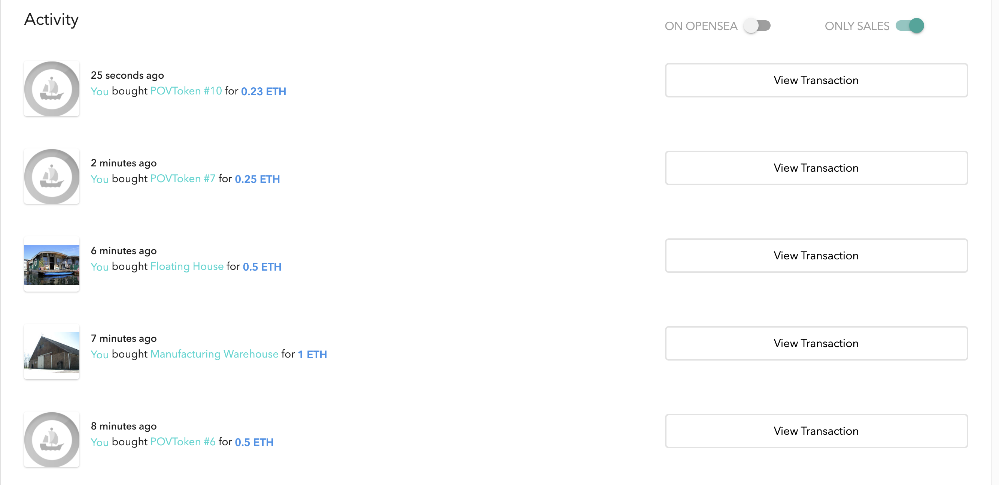

# Udacity Blockchain Capstone

The capstone will build upon the knowledge you have gained in the course in order to build a decentralized housing product. 

# Write up for testing
`rm -rf node_modules`
`npm install`
*make sure truffle is running*
`truffle test`

# Post Deploy Details
## Deployment File Link
https://github.com/agarwalparesh53/Blockchain-Capstone/blob/master/deployment.txt

## Contract 
https://rinkeby.etherscan.io/address/0x5C834AD019CF47c4e55D5969eca4eEc5f966338B

## Contract ABI
https://github.com/agarwalparesh53/Blockchain-Capstone/blob/master/contract_abi.json

## Open Sea Market Place
https://rinkeby.opensea.io/assets/povtoken

## Open Sea Purchase Transactions

- https://rinkeby.etherscan.io/tx/0x98678e40c1e26c418f4dfb9892b27a739af0f20d381c48a07d5b6a29024d4d6b
- https://rinkeby.etherscan.io/tx/0xe0cb0e7cbfa0201668fc7f275e44eeaef955c5f6488ad78654605bbfb3b7fd5a
- https://rinkeby.etherscan.io/tx/0x1e89f059de56371eab6172eddf62683294f7884aa376d3cc02b557ada3de87ae
- https://rinkeby.etherscan.io/tx/0xc5895696383edec52994a5dc57e26d73a8aebb8691f28842b99769b24f5abbd5
- https://rinkeby.etherscan.io/tx/0xa977bbd48966bea27a354a6d2cd96a4270c1701831205d89e1d24f7f0db60805

# Project Resources

* [Remix - Solidity IDE](https://remix.ethereum.org/)
* [Visual Studio Code](https://code.visualstudio.com/)
* [Truffle Framework](https://truffleframework.com/)
* [Ganache - One Click Blockchain](https://truffleframework.com/ganache)
* [Open Zeppelin ](https://openzeppelin.org/)
* [Interactive zero knowledge 3-colorability demonstration](http://web.mit.edu/~ezyang/Public/graph/svg.html)
* [Docker](https://docs.docker.com/install/)
* [ZoKrates](https://github.com/Zokrates/ZoKrates)
